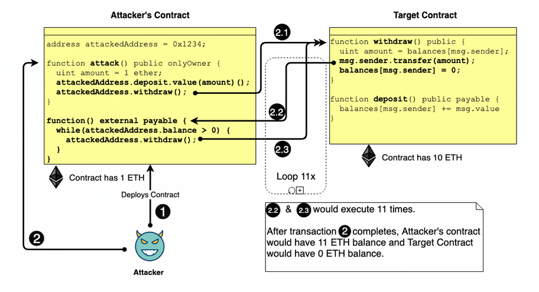

# Reentrancy attacks

Many hacks in the past have used this technique. In this attack technique, an attacker deploys a new contract and calls a specific function on the target contract. The call sends ether to the attacker's contract, and their contract makes a function call to the target contract again. This process continues in a loop until all the ether or funds from the target contract is drained in the attacker's contract.

Let's look at an example where a reentrancy attack is possible:

```
//Bad Practice
function withdraw() public {
    uint amount = balances[msg.sender];
    msg.sender.transfer(amount);
    balances[msg.sender] = 0;
}
```

In the preceding code, using the withdraw() function, a user can withdraw their ether balance, which they have deposited to this contract previously. As you can see in the code, it reads the user's balance and sends that amount of ether to the function caller, and, at the end, it resets the balance of that function caller. As we learned previously, in Solidity, you can write a fallback function that can receive ether and execute some code. An attacker can deploy a contract, in which they will add a fallback function, as follows:

```
//Code used by an Attacker
address attackedAddress = 0x1234;

function attack() public onlyOwner {
    attackedAddress.withdraw();
}

function() external payable {
    while(attackedAddress.balance > 0) {
        attackedAddress.withdraw();
    }
}
```

In the preceding code attackedAddress value is the address of the contract (which contains ether) on which an attack will be performed. An attacker will deploy this contract and initiate attack to a target contract via the attack() function:


Reentrancy attack by an attacker

The preceding diagram shows how an attacker could exploit reentrancy vulnerability present in the Target Contract. Let's look at the transaction flow shown in the preceding diagram:

Lets assume the following is the initial state of the contract:

- Target Contract has 10 ETH present in it.
- Attacker's Contract has not deposited any ETH to Target Contract yet. It means the attacker's contract, balance[msg.sender], is 0 in Target Contract.

Transactions are executed in the following order:

1. The attacker deploys his contract called an Attacker's Contract. He also deposits 1 ETH into his deployed contract. This transaction is shown as (1) in the preceding diagram.

2. The attacker calls the attack() function (transaction (2) shown in the diagram) on his deployed contract and the following internal transactions are executed:

   1. The deposit() function call deposits 1 ether to Target Contract. This updates the Attacker's Contract balance[msg.sender] balance to 1 ether. It further calls the withdraw() function in the Target Contract. This internal transaction is shown as (2.1) in the preceding diagram.
   2. The withdraw() function present in Target Contract sends 1 ether to Attacker's Contract via the msg.sender.transfer(amount) function call. This, in turn, triggers the fallback function of Attacker's Contract. This transaction is shown as (2.2) in the preceding diagram.
   3. The fallback function checks that Target Contract still has some ether balance in it. If it has balance left, then make a call to the withdraw() function in the Target Contract. This transaction is shown as (2.3) in the preceding diagram.

3. The preceding process of internal transactions (2.2) and (2.3) continues until Target Contract's ether balance is not empty.
4. After executing (2.2) and (2.3) 11 times, transaction (2) would complete and the balance of Attacker's Contract would be 11 ether, and the balance of Target Contract would be 0 ether.

As you can see using the above reentrancy attack an attacker was able to drain the target contract. The conditions and loop settings might vary according to the code of the attacker's contract and the target contract.

Let's look at the technique to prevent a reentrancy attack.

## Preventing a reentrancy attack

To prevent a reentrancy attack, the state of the variables should be updated first, and then ether should be sent to a user's account as follows:

```
// Good Practice
function withdraw() public {
    uint amount = balances[msg.sender];
    balances[msg.sender] = 0;
    msg.sender.transfer(amount);
}
```

In the preceding code, we are updating the balance of the user's account to 0 (zero), and then only sending the ether to the user.

Remember to always update the relevant state variables first and then only transfer ether at the last step.
